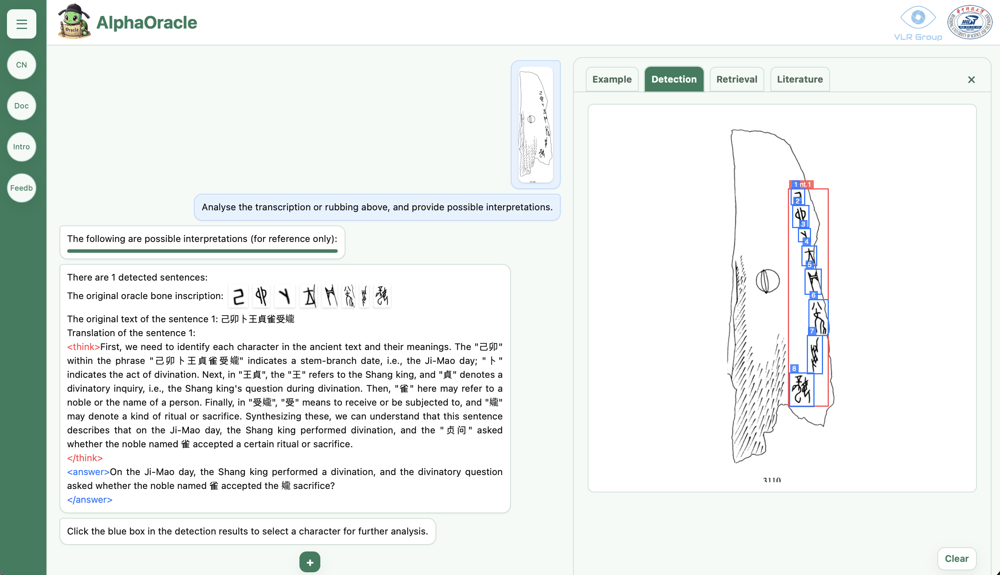
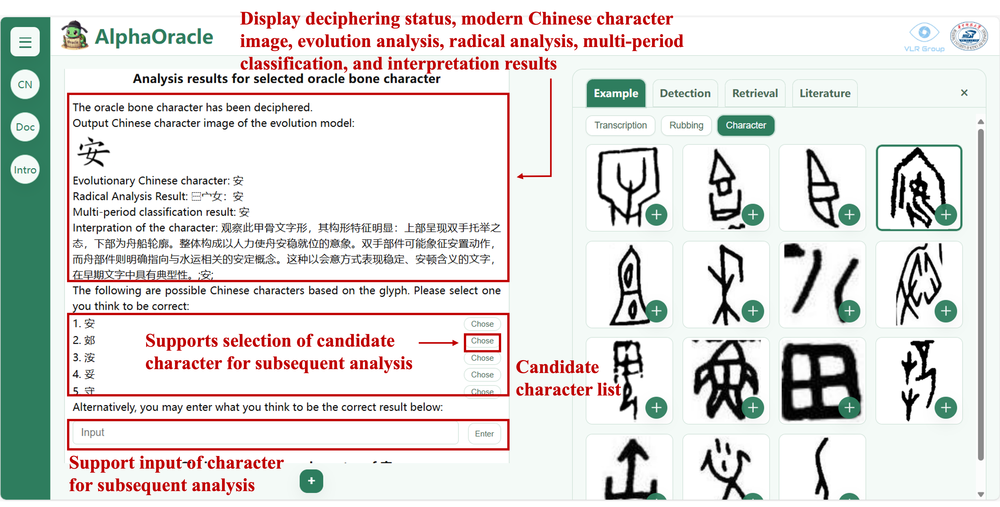
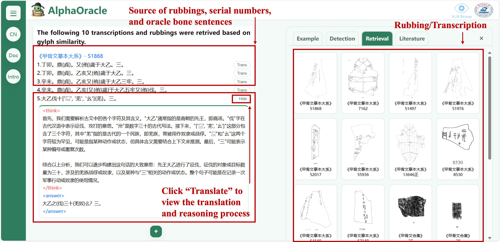
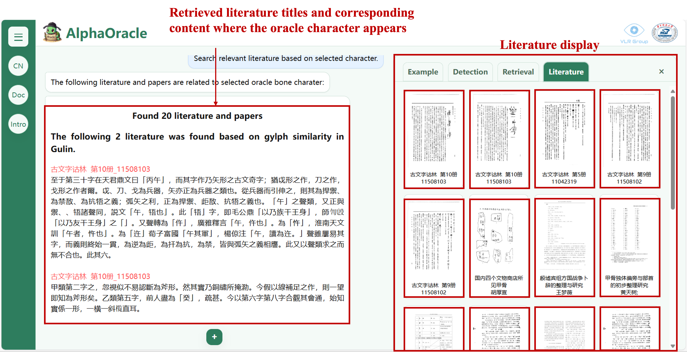
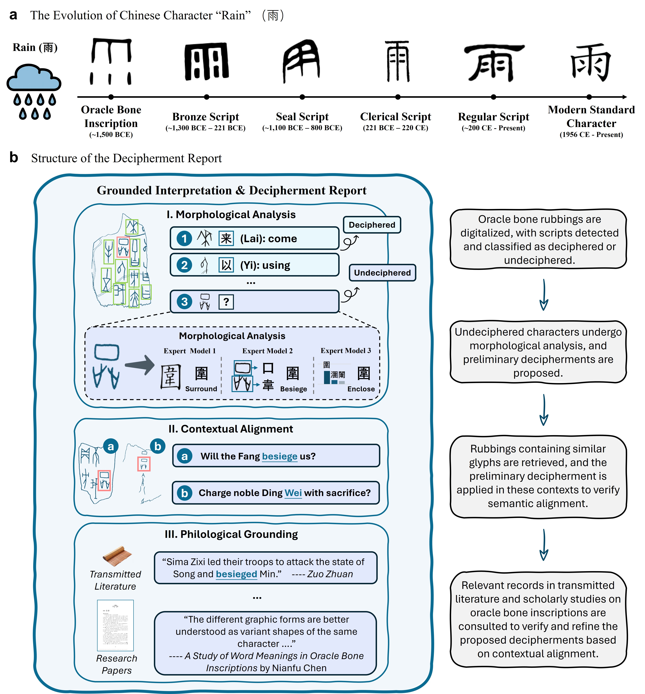

<div align="center">
  
</div>

<div align="center">
<h3>Oracle bone script decipherment via human-workflow-inspired deep learning</h3>
  <p>Yuliang Liu<sup>*,†</sup>, Haisu Guan<sup>*</sup>, PengJie Wang<sup>*</sup>, Xinyu Wang<sup>*</sup>, Jinpeng Wan, Kaile Zhang, Handong Zheng, Xingchen Liu, Zhebin Kuang, Huanxin Yang, Bang Li, Yonge Liu, Lianwen Jin<sup>†</sup> and Xiang Bai<sup>†</sup></p>
<p><sup>*</sup>Equal contribution, <sup>†</sup>Corresponding author</p>
</div>

We introduce a human-workflow-inspired approach AlphaOracle that accelerates oracle bone scholarship while preserving transparency and rigor

<div align="center">


[](http://www.alphaoracle.cn:8224/?lan=en)
[](LICENSE)

[English](README.md) | [中文](README_zh-CN.md)

</div>

---

<details open><summary>💡 I also have other projects that may interest you ✨. </summary><p>
<!--  may -->
    
> [**Deciphering Oracle Bone Language with Diffusion Models**](https://arxiv.org/abs/2406.00684) <br>
> Haisu Guan, Huanxin Yang, Xinyu Wang, Shengwei Han, Yongge Liu, Lianwen Jin, Xiang Bai, Yuliang Liu <br>
[](https://github.com/guanhaisu/OBSD) [](https://arxiv.org/abs/2406.00684) <br>
    
> [**Puzzle Pieces Picker: Deciphering Ancient Chinese Characters with Radical Reconstruction**](https://arxiv.org/abs/2406.03019) <br>
> Pengjie Wang, Kaile Zhang, Xinyu Wang, Shengwei Han, Yongge Liu, Lianwen Jin, Xiang Bai, Yuliang Liu <br>
[](https://github.com/Pengjie-W/Puzzle-Pieces-Picker) [](https://arxiv.org/abs/2406.03019) <br>

> [**An open dataset for oracle bone character recognition and decipherment**](https://www.nature.com/articles/s41597-024-03807-x) <br>
> Pengjie Wang, Kaile Zhang, Xinyu Wang, Shengwei Han, Yongge Liu, Jinpeng Wan, Haisu Guan, Zhebin Kuang, Lianwen Jin, Xiang Bai Yuliang Liu <br>
[](https://github.com/Pengjie-W/HUST-OBC) [](https://www.nature.com/articles/s41597-024-03807-x) <br>

> [**An open dataset for the evolution of oracle bone characters: EVOBC**](https://arxiv.org/abs/2401.12467) <br>
> Haisu Guan, Jinpeng Wan, Yuliang Liu, Pengjie Wang, Kaile Zhang, Zhebin Kuang, Xinyu Wang, Xiang Bai, Lianwen Jin <br>
[](https://github.com/RomanticGodVAN/character-Evolution-Dataset) [](https://arxiv.org/abs/2401.12467) <br>

## 📰 News

* `[2025.10.5]`  We have released the paper and [demo](http://www.alphaoracle.cn:8224/?lan=en) of AlphaOracle.

</p></details>

## Key Features

- Analysis of oracle bone rubbings and transcriptions: involving character detection, character recognition, sentence segmentation, intra-sentence ordering, and translation into Modern Chinese.
<div align="center">
  
</div>

- Analysis and Decipherment of Individual Oracle Bone Characters: investigating the diachronic evolution of their glyph forms, analyzing their component structures and configurations, and generating descriptions of their morphological features. 
<div align="center">
  
</div>

- Retrieval for Oracle Bone Characters: using a single character image as a query, the system retrieves all characters with similar glyph shapes from the database. For each result, it provides the corresponding complete rubbing or transcription in which the character is found.
<div align="center">
  
</div>

- Associative Literature Retrieval: based on the glyphic form and semantic meaning of a specific oracle bone character, the system performs a deep search across a dual corpus—encompassing early transmitted Chinese texts (from the pre-Qin and Han dynasties) and modern scholarly literature—to discover and present the most relevant discussions, evidence, and research findings.

<div align="center">
  
</div>

<div align="center">
  
</div>

## Tutorial

This project includes a Jupyter Notebook that demonstrates the usage of each API in AlphaOracle. It begins by defining common utilities and wrapper functions, and then demonstrates the input and output formats for each task in separate code blocks.

[View the Tutorial Notebook](example/demo.ipynb)


## Data Sources

This project draws upon a comprehensive collection of textual and inscriptional resources, including:

### Oracle Bone Inscription Databases:
- **Rubbings and Transcriptions**: 
  - 《Jia Gu Wen He Ji》 
  - 《Jia Gu Wen Mo Ben Da Xi》
  - 《Jia Gu Wen Jiao Shi Zong Ji》
- **Glyph Information**:
  - 《Xin Jia Gu Wen Bian》
  - 《Jia Gu Wen Liu Wei Shu Zi Ma Jian Suo Zi Ku》
  - 《Xi Zhou Jin Wen Zi Bian》
  - 《Chun Qiu Wen Zi Zi Xing Biao》
  - 《Zhan Guo Wen Zi Zi Xing Biao》
  - 《Shuo Wen Jie Zi》
  - Yin Qi Wen Yuan (website)
  - Guo Xue Da Shi (website)
- **Interpretive Resources**:
  - 《Gu Wen Zi Gu Lin》
  - 《Jia Gu Wen Gu Lin》
- **Sentence Translation**:
  - 《Jia Gu Wen Jing Cui Shi Yi》

### Pre-Qin and Han Transmitted Texts:
- 《Han Shu》, 《Shi Ji》, 《Zuo Zhuan》, 《Huangdi Neijing》, 《Zhanguo Ce》, 《Huainanzi》, 《Han Feizi》, 《Li Ji》, 《Lu Shi Chunqiu》, 《Guo Yu》, 《Yi Li》, 《Zhuangzi》, 《Mozi》, 《Zhou Li》, 《Mengzi》, 《Shan Hai Jing》, 《Shang Shu》, 《Xunzi》, 《Lunyu》, 《Yizhuan》, 《Sun Bin Bingfa》, 《Laozi》, 《Sunzi Bingfa》, 《Wuzi》

### Modern Scholarly Literature:
A vast collection of modern academic papers and research reports focusing on oracle bone script, paleography, ancient Chinese history, and related fields. For a detailed list, please refer to the [original data source](http://www.alphaoracle.cn:8224/wenxian?lan=en).

## Video Demonstration

https://github.com/user-attachments/assets/69ea0636-37bb-4fef-a0f6-80a27fa21105

We provide the website [AlphaOracle](http://www.alphaoracle.cn:8224/?lan=en) for quick experience and use.

## To Do List

- [✔] Demo
- [ ] API
- [ ] Model Weights
- [ ] Inference Code
- [ ] Full Decipherment Pipeline
- [ ] Training Code

## Academic Statement

We are committed to providing cutting-edge AI assistance. However, due to inherent technological and data limitations, the output may contain discrepancies or misinterpretations. If you reference insights from this system in any published work, please include an appropriate acknowledgement and conduct your own final academic verification.

## License

[Apache License](LICENSE)

## ✏️ Citation

```BibTeX
@article{liu2025oracle,
  title={Oracle bone script decipherment via human-workflow-inspired deep learning},
  author={Yuliang Liu, Haisu Guan, PengJie Wang, Xinyu Wang, Jinpeng Wan, Kaile Zhang, Handong Zheng, Xingchen Liu, Zhebin Kuang, Huanxin Yang, Bang Li, Yonge Liu, Lianwen Jin and Xiang Bai},
  year={2025}
}
```

## 🤝 Contributors

<a href="https://github.com/Yuliang-Liu/AlphaOracle/graphs/contributors">
  
</a>

© 2025 AlphaOracle Project Team
