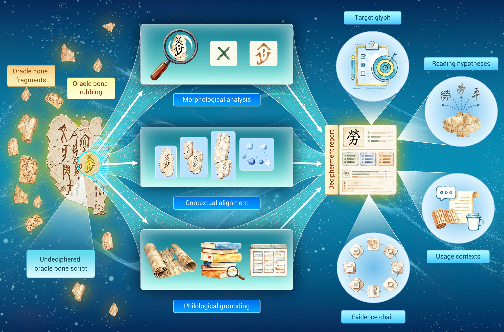
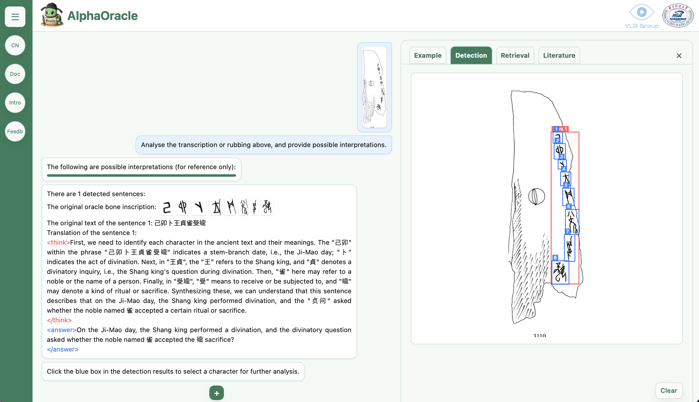
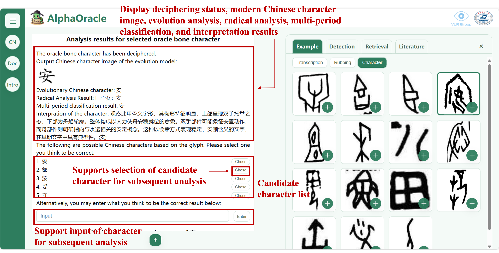
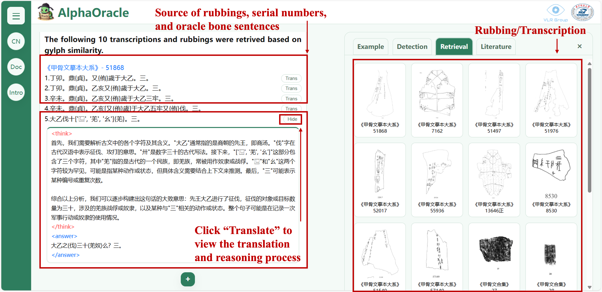
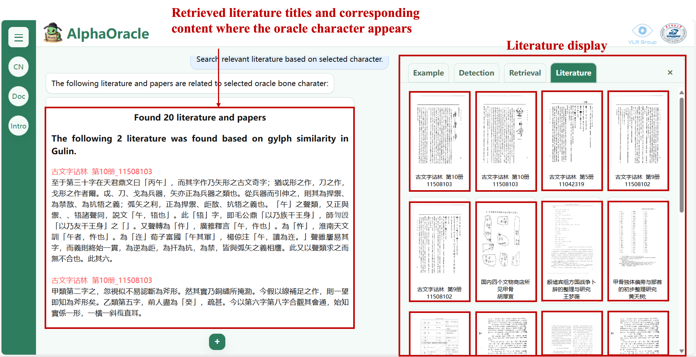
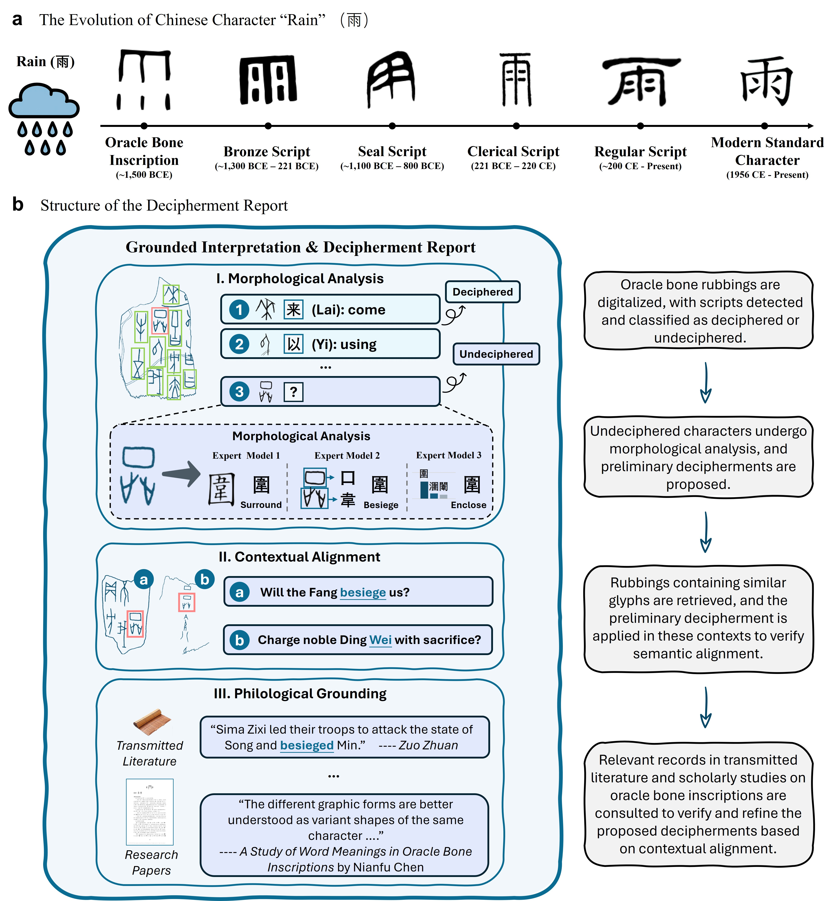

<div align="center">
  
</div>

<div align="center">

# AlphaOracle: Oracle bone script decipherment via human-workflow-inspired deep learning

**Yuliang Liu<sup>*,†</sup>, Haisu Guan<sup>*</sup>, PengJie Wang<sup>*</sup>, Xinyu Wang<sup>*</sup>, Jinpeng Wan, Kaile Zhang, Handong Zheng, Xingchen Liu, Zhebin Kuang, Huanxin Yang, Bang Li, Yongge Liu<sup>†</sup>, Lianwen Jin<sup>†</sup>, Xiang Bai<sup>†</sup>**

<p><sup>*</sup>Equal contribution, <sup>†</sup>Corresponding authors</p>

</div>

<div align="justify">
Oracle bone script (OBS) is one of the world’s independently evolved scripts, yet approximately 3,000 of its 4,500 characters remain undeciphered due to fragmentary inscriptions and sparse evidence. Current AI approaches often fail to replicate expert workflows that integrate form analysis, contextual semantics, and philological reasoning. We present AlphaOracle, a comprehensive, workflow-inspired framework that systematizes OBS decipherment by integrating computer vision, computational linguistics, and classical philology. AlphaOracle curates the largest digitized OBS resources to date and operationalizes them through a multi-stage framework comprising rubbing parsing, radical-based morphological analysis with diachronic modeling, contextual retrieval with semantic alignment, and philological validation against classical sources. Each stage yields explicit evidence chains with quantitative scores, culminating in interpretable reports for scholarly verification. Our results indicate that computational methods, when aligned with philological practice, can accelerate OBS decipherment and provide a framework that could inform the study of other undeciphered scripts within digital humanities and cultural heritage research.
</div>

<div align="center">
  <a href="https://www.sciencedirect.com/science/article/pii/S2666675826002092">
    
  </a>
</div>

<div align="center">


[](http://vlrlabmonkey.xyz:7685/?lan=en)
[](https://www.sciencedirect.com/science/article/pii/S2666675826002092)
[](https://doi.org/10.1016/j.xinn.2026.101462)
[](https://www.sciencedirect.com/science/article/pii/S2666675826002092)
[](LICENSE)
[](CITATION.cff)

**Published in [The Innovation](https://www.sciencedirect.com/science/article/pii/S2666675826002092), available online June 12, 2026.**

[English](README.md) | [中文](README_zh-CN.md)

</div>


<!-- <details open><summary>💡 I also have other projects that may interest you ✨. </summary><p>
    
> [**Deciphering Oracle Bone Language with Diffusion Models**](https://arxiv.org/abs/2406.00684) <br>
> Haisu Guan, Huanxin Yang, Xinyu Wang, Shengwei Han, Yongge Liu, Lianwen Jin, Xiang Bai, Yuliang Liu <br>
[](https://github.com/guanhaisu/OBSD) [](https://arxiv.org/abs/2406.00684) <br>
    
> [**Puzzle Pieces Picker: Deciphering Ancient Chinese Characters with Radical Reconstruction**](https://arxiv.org/abs/2406.03019) <br>
> Pengjie Wang, Kaile Zhang, Xinyu Wang, Shengwei Han, Yongge Liu, Lianwen Jin, Xiang Bai, Yuliang Liu <br>
[](https://github.com/Pengjie-W/Puzzle-Pieces-Picker) [](https://arxiv.org/abs/2406.03019) <br>

> [**An open dataset for oracle bone character recognition and decipherment**](https://www.nature.com/articles/s41597-024-03807-x) <br>
> Pengjie Wang, Kaile Zhang, Xinyu Wang, Shengwei Han, Yongge Liu, Jinpeng Wan, Haisu Guan, Zhebin Kuang, Lianwen Jin, Xiang Bai, Yuliang Liu <br>
[](https://github.com/Pengjie-W/HUST-OBC) [](https://www.nature.com/articles/s41597-024-03807-x) <br>

> [**An open dataset for the evolution of oracle bone characters: EVOBC**](https://arxiv.org/abs/2401.12467) <br>
> Haisu Guan, Jinpeng Wan, Yuliang Liu, Pengjie Wang, Kaile Zhang, Zhebin Kuang, Xinyu Wang, Xiang Bai, Lianwen Jin <br>
[](https://github.com/RomanticGodVAN/character-Evolution-Dataset) [](https://arxiv.org/abs/2401.12467) <br> -->

</p></details>

## Key Features

- Rubbing Parsing: involving character detection, character recognition, sentence segmentation, intra-sentence ordering, and translation into Modern English/Chinese.
<div align="center">
  
</div>

- Morphological Analysis: investigating the diachronic evolution of their glyph forms, analyzing their component structures and configurations, and generating descriptions of their morphological features. 
<div align="center">
  
</div>

- Contextual Alignment: given a single character image as a query, the system retrieves visually similar glyphs and displays each within its full rubbing or transcription context. This allows researchers to examine how the character appears across inscriptions, compare its usage in different settings, and identify patterns of meaning, function, or variation that inform its interpretation.
<div align="center">
  
</div>

- Philological Grounding: based on the glyphic form and semantic meaning of a specific oracle bone character, the system performs a deep search across a dual corpus—encompassing early transmitted Chinese texts (from the pre-Qin and Han dynasties) and modern scholarly literature—to discover and present the most relevant discussions, evidence, and research findings.

<div align="center">
  
</div>
<!-- 
<div align="center">
  
</div> -->

## Tutorial

This project includes a Jupyter Notebook that demonstrates the usage of each API in AlphaOracle. It begins by defining common utilities and wrapper functions, and then demonstrates the input and output formats for each task in separate code blocks.

[View the Tutorial Notebook](example/demo.ipynb)


## Data Sources

This project draws upon a comprehensive collection of textual and inscriptional resources, including:

### Oracle Bone Inscription Databases:
- **Rubbings and Transcriptions**: 
  - 《Jia Gu Wen He Ji》 
  - 《Jia Gu Wen Mo Ben Da Xi》
  - 《Jia Gu Wen Jiao Shi Zong Ji》
- **Glyph Information**:
  - 《Xin Jia Gu Wen Bian》
  - 《Jia Gu Wen Liu Wei Shu Zi Ma Jian Suo Zi Ku》
  - 《Xi Zhou Jin Wen Zi Bian》
  - 《Chun Qiu Wen Zi Zi Xing Biao》
  - 《Zhan Guo Wen Zi Zi Xing Biao》
  - 《Shuo Wen Jie Zi》
  - Yin Qi Wen Yuan (website)
  - Guo Xue Da Shi (website)
- **Interpretive Resources**:
  - 《Gu Wen Zi Gu Lin》
  - 《Jia Gu Wen Gu Lin》
- **Sentence Translation**:
  - 《Jia Gu Wen Jing Cui Shi Yi》

### Pre-Qin and Han Transmitted Texts:
- 《Han Shu》, 《Shi Ji》, 《Zuo Zhuan》, 《Huangdi Neijing》, 《Zhanguo Ce》, 《Huainanzi》, 《Han Feizi》, 《Li Ji》, 《Lu Shi Chunqiu》, 《Guo Yu》, 《Yi Li》, 《Zhuangzi》, 《Mozi》, 《Zhou Li》, 《Mengzi》, 《Shan Hai Jing》, 《Shang Shu》, 《Xunzi》, 《Lunyu》, 《Yizhuan》, 《Sun Bin Bingfa》, 《Laozi》, 《Sunzi Bingfa》, 《Wuzi》 

### Modern Scholarly Literature:
A vast collection of modern academic papers and research reports focusing on oracle bone script, paleography, ancient Chinese history, and related fields. For a detailed list, please refer to the [original data source](http://vlrlabmonkey.xyz:7685/wenxian?lan=en).

## Video Demonstration

https://github.com/user-attachments/assets/69ea0636-37bb-4fef-a0f6-80a27fa21105

We provide the website [AlphaOracle](http://vlrlabmonkey.xyz:7685/?lan=en) for quick experience and use.

<!-- ## TODO

- [x] Demo
- [ ] API
- [ ] Model Weights
- [ ] Inference Code
- [ ] Full Decipherment Pipeline
- [ ] Training Code -->

## Academic Statement

We are committed to delivering high-quality assistance for oracle bone script decipherment. However, due to inherent technological and data limitations, the outputs may contain occasional inaccuracies or misinterpretations. If you reference insights generated by this system in any published work, please provide appropriate acknowledgement and conduct independent academic verification before publication.

## License

[Apache License](LICENSE)

## ✏️ Citation

If you find this project useful, please cite our paper:

```BibTeX
@article{liu2026alphaoracle,
  title   = {AlphaOracle: Oracle bone script decipherment via human-workflow-inspired deep learning},
  author  = {Liu, Yuliang and Guan, Haisu and Wang, PengJie and Wang, Xinyu and Wan, Jinpeng and Zhang, Kaile and Zheng, Handong and Liu, Xingchen and Kuang, Zhebin and Yang, Huanxin and Li, Bang and Liu, Yongge and Jin, Lianwen and Bai, Xiang},
  journal = {The Innovation},
  pages   = {101462},
  year    = {2026},
  month   = {June},
  issn    = {2666-6758},
  doi     = {10.1016/j.xinn.2026.101462}
}
```

## 🤝 Contributors

<a href="https://github.com/Yuliang-Liu/AlphaOracle/graphs/contributors">
  
</a>

© 2026 AlphaOracle Project Team
