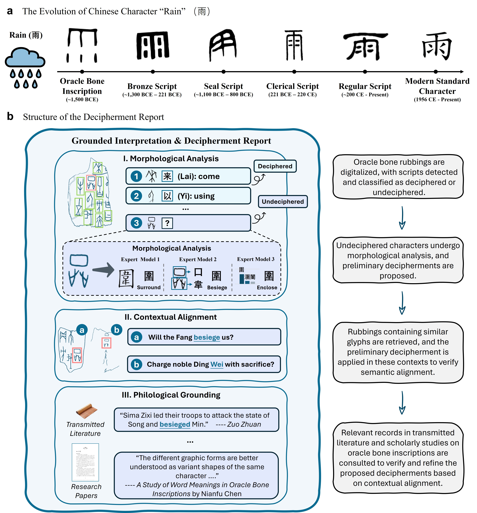

<div align="center">
  
</div>

<div align="center">
<h3>利用受人类工作流启发的深度学习框架破译甲骨文</h3>
  <p>刘禹良<sup>*,†</sup>, 管海粟<sup>*</sup>, 王鹏杰<sup>*</sup>, 王欣雨<sup>*</sup>, 万金鹏, 张凯乐, 郑汉东, 刘星辰, 匡嚞玢, 杨焕鑫, 李邦, 刘永革, 金连文<sup>†</sup>, 白翔<sup>†</sup></p>
<p><sup>*</sup>同等贡献, <sup>†</sup>通讯作者</p>
</div>

<div align="center">
甲骨文（Oracle Bone Script，简称 OBS）是世界上少数几种独立发展起来的文字体系之一，但约 4500 个甲骨文字中仍有约三分之二尚未被破译，其原因在于字形晦涩、文辞零散且残缺、以及缺乏充分的旁证材料。我们提出 AlphaOracle，一个以工作流为灵感的综合性框架，通过整合计算机视觉、计算语言学与古文字学方法，系统化地推进甲骨文的破译研究。AlphaOracle 汇集了迄今为止规模最大的甲骨文字数字化资源，并通过一个多阶段框架将其转化为可操作的研究流程：包括拓片解析、基于部件的形态分析与历时建模、语义对齐下的语境检索、以及结合古文献的文字学验证。框架的每一阶段都生成带有量化评分的显式证据链，最终汇总为可解释的报告，以供学术验证。研究结果表明，当计算方法与文字学研究实践相结合时，不仅能加速甲骨文的破译进程，还能为数字人文学与文化遗产研究领域中其他未解读文字的研究提供新的理论与方法框架。
</div>

<div align="center">


[](http://www.alphaoracle.cn:8224/)
[](LICENSE)

[English](README.md) | [中文](README_zh-CN.md)

</div>

---

<!-- <details open><summary>💡 我还有其他您可能感兴趣的项目 ✨。</summary><p>
    
> [**Deciphering Oracle Bone Language with Diffusion Models**](https://arxiv.org/abs/2406.00684) <br>
> 管海粟, 杨焕鑫, 王欣雨, 韩胜伟, 刘永革, 金连文, 白翔, 刘禹良 <br>
[](https://github.com/guanhaisu/OBSD) [](https://arxiv.org/abs/2406.00684) <br>
    
> [**Puzzle Pieces Picker: Deciphering Ancient Chinese Characters with Radical Reconstruction**](https://arxiv.org/abs/2406.03019) <br>
> 王鹏杰, 张凯乐, 王欣雨, 韩胜伟, 刘永革, 金连文, 白翔, 刘禹良 <br>
[](https://github.com/Pengjie-W/Puzzle-Pieces-Picker) [](https://arxiv.org/abs/2406.03019) <br>

> [**An open dataset for oracle bone character recognition and decipherment**](https://www.nature.com/articles/s41597-024-03807-x) <br>
> 王鹏杰, 张凯乐, 王欣雨, 韩胜伟, 刘永革, 万金鹏, 管海粟, 匡嚞玢, 金连文, 白翔, 刘禹良 <br>
[](https://github.com/Pengjie-W/HUST-OBC) [](https://www.nature.com/articles/s41597-024-03807-x) <br>

> [**An open dataset for the evolution of oracle bone characters: EVOBC**](https://arxiv.org/abs/2401.12467) <br>
> 管海粟, 万金鹏, 刘禹良, 王鹏杰, 张凯乐, 匡嚞玢, 王欣雨, 白翔, 金连文 <br>
[](https://github.com/RomanticGodVAN/character-Evolution-Dataset) [](https://arxiv.org/abs/2401.12467) <br> -->

## 📰 新闻

* `[2025.10.5]` 我们发布了 AlphaOracle 的论文和[演示](http://www.alphaoracle.cn:8224/)。

</p></details>

## 核心功能

- 甲骨文拓片与摹本分析：覆盖字符检测、字符识别、句子切分、句内排序以及翻译为现代汉语等步骤。
<div align="center">
  
</div>
- 单字分析与释读：考察甲骨文字形的历时演变，分析部件结构与构形，并生成其形态特征描述。
<div align="center">
  
</div>
- 甲骨单字检索：以单个字形图像为查询，在数据库中召回所有形体相近的甲骨文字，并提供该字所在完整拓片或摹本信息。
<div align="center">
  
</div>
- 关联文献检索：围绕特定甲骨文字的形体特征与语义，跨越早期传世文献与现代学术成果的双重语料库进行深度检索，呈现最相关的讨论、证据与研究结论。
<div align="center">
  
</div>
<div align="center">
  
</div>

## 使用教程

项目附带 Jupyter Notebook，逐步演示 AlphaOracle 每个 API 的调用方式。Notebook 先定义常用工具与封装函数，再为每项任务分别展示输入输出示例。

[查看示例 Notebook](example/demo.ipynb)


## 数据来源

本项目汇聚了丰富的甲骨文资料与相关文献，包括：

### 甲骨文数据库：
- **拓片与摹本**：
  - 《甲骨文合集》
  - 《甲骨文摹本大系》
  - 《甲骨文校释总集》
- **字形信息**：
  - 《新甲骨文编》
  - 《甲骨文六位数字码检索字库》
  - 《西周金文字编》
  - 《春秋文字字形表》
  - 《战国文字字形表》
  - 《说文解字》
  - 殷契文渊（网站）
  - 国学大师（网站）
- **释读参考**：
  - 《古文字诂林》
  - 《甲骨文诂林》
- **句子翻译**：
  - 《甲骨文精粹释译》

### 先秦两汉传世文献：
- 《汉书》, 《史记》, 《左传》, 《黄帝内经》, 《战国策》, 《淮南子》, 《韩非子》, 《礼记》, 《吕氏春秋》, 《国语》, 《仪礼》, 《庄子》, 《墨子》, 《周礼》, 《孟子》, 《山海经》, 《尚书》, 《荀子》, 《论语》, 《易传》, 《孙膑兵法》, 《老子》, 《孙子兵法》, 《吴子》

### 现代学术文献：
覆盖甲骨文、古文字、先秦史等相关领域的大量学术论文与研究报告。更多详情请参见[原始数据来源](http://www.alphaoracle.cn:8224/wenxian)。

## 视频演示

https://github.com/user-attachments/assets/69ea0636-37bb-4fef-a0f6-80a27fa21105

我们提供了网站 [AlphaOracle](http://www.alphaoracle.cn:8224) 以便快速体验和使用。

<!-- ## 待办事项

- [x] 演示
- [ ] API
- [ ] 模型权重
- [ ] 推理代码
- [ ] 完整的释读流程
- [ ] 训练代码 -->

## 学术声明

我们致力于提供前沿的 AI 辅助。然而，由于固有的技术和数据限制，输出可能包含差异或误解。如果您在任何已发表的作品中引用本系统的见解，请附上适当的致谢，并进行您自己的最终学术验证。

## 许可协议

[Apache License](LICENSE)

<!-- ## ✏️ 引用

```BibTeX
@article{liu2025oracle,
  title={Oracle bone script decipherment via human-workflow-inspired deep learning},
  author={Yuliang Liu, Haisu Guan, PengJie Wang, Xinyu Wang, Jinpeng Wan, Kaile Zhang, Handong Zheng, Xingchen Liu, Zhebin Kuang, Huanxin Yang, Bang Li, Yonge Liu, Lianwen Jin and Xiang Bai},
  year={2025}
}
``` -->

## 🤝 贡献者

<a href="https://github.com/Yuliang-Liu/AlphaOracle/graphs/contributors">
  
</a>

© 2025 AlphaOracle 项目组
